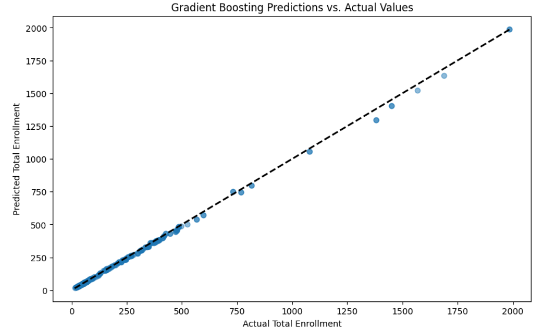

# School Enrollment Forecasting Project

## Overview
This project aims to forecast 10-year school enrollment for the Springfield R-XII School District using machine learning techniques. The goal is to provide more accurate and nuanced predictions than traditional methods, aiding in resource allocation, policy planning, and infrastructure development.

## Project Structure
- `data/`: Directory containing datasets used in the project.
- `scripts/`: Python scripts for data processing, model training, and evaluation.
- `models/`: Trained model files.
- `requirements.txt`: List of package dependencies for the project.
- `.gitignore`: Specifies intentionally untracked files that Git should ignore. Includes sensitive data, environment files, and system-specific files that are not part of the source code.

## Installation
Ensure you have Python installed on your system. This project was developed using Python 3.8. It's recommended to use a virtual environment to manage dependencies.

1. Clone this repository to your local machine.
2. Navigate to the project directory and create a virtual environment:
3. Activate the virtual environment:
- On Windows:
  ```
  .venvCap\Scripts\activate
  ```
- On Unix or MacOS:
  ```
  source .venvCap/bin/activate
  ```
4. Install the required packages:

## Packages Installed
The following Python packages are essential for this project and have been installed:

- `numpy`: For numerical computations and array operations.
- `pandas`: For data manipulation and analysis.
- `matplotlib`: For creating static, animated, and interactive visualizations.
- `seaborn`: For making attractive and informative statistical graphics.
- `scikit-learn`: For machine learning algorithms and data preprocessing.

## Usage
This project consists of Python scripts that perform data processing, analysis, and model training. Follow the steps below to run the main script:

1. **Activate the Virtual Environment:**
   Ensure your virtual environment is activated to use the project-specific dependencies.
   - On **Windows**:
     ```
     .venvCap\Scripts\activate
     ```
   - On **Unix or MacOS**:
     ```
     source .venvCap/bin/activate
     ```
2. Install the required packages using the following command:
    pip install -r requirements.txt


3. **Navigate to the Scripts Directory:**
   Change to the `scripts/` directory where your Python scripts are located.
      cd scripts/

4. **Run the cleaning Script:**
  python data_cleaning_script.py
This script will process the data files located in the `data/` directory and output cleaned data ready for analysis. Check the `data/` directory for the cleaned datasets.

## Running Analysis Notebooks

The analysis notebooks provide a detailed exploration of the data and the modeling process. To view and run these notebooks:

1. Ensure you're in the project's root directory and activate your virtual environment.

2. Start Jupyter Notebook or JupyterLab:

OR

3. Navigate to the `notebooks/` directory in the Jupyter interface and open the analysis notebooks.

4. Run the cells in the notebook to perform the analysis and view the results.

## Data Sources

The data used in this project was sourced from the following:

- **DESE Data**: Enrollment figures and related educational data were obtained from the [Missouri Department of Elementary and Secondary Education (DESE)](https://apps.dese.mo.gov/MCDS/home.aspx). The data was filtered to include relevant information for the Springfield R-XII School District.

- **2020 ACS Data**: Demographic information was sourced from the [2020 American Community Survey 5-Year Estimates](https://data.census.gov/table/ACSST5Y2020.S0101), provided by the U.S. Census Bureau. Data was filtered to match the geographic scope of the school district.

- **ACS Data**: Additional demographic data was sourced from the [American Community Survey 1-Year Estimates for 2022](https://data.census.gov/table/ACSDT1Y2022.B09001?q=B09001), also provided by the U.S. Census Bureau. This data was similarly filtered for the appropriate geographies.

All data was utilized in compliance with their respective terms of use and was filtered to the specific geographies relevant to the Springfield R-XII School District to ensure the accuracy and relevance of the analysis.


## Screenshots

Below are some screenshots from the analysis notebooks, highlighting key findings and visualizations:

## Model Scatterplots

### Decision Tree Predicted vs Actual Enrollment


### Gradient Boosting Predicted vs Actual Enrollment


### Linear Regression Predicted vs Actual Enrollment


### Random Forest Predicted vs Actual Enrollment


## Performance Comparison

### Model Performance Overview


### Dataset Performance Summary


## Project Report

For a detailed write-up of the project's methodology, findings, and analyses, please refer to the comprehensive report available on Overleaf:

[School Enrollment Forecasting Project Report](https://www.overleaf.com/read/jqwfxmcgnfsg#3b86ff)

This report includes an in-depth discussion of the data cleaning process, exploratory data analysis, model development, results interpretation, and future work recommendations.

## Conclusion and Future Work

This project provides a foundational approach to forecasting school enrollment using machine learning. While the current models offer significant improvements over traditional methods, future work will focus on incorporating more granular data and exploring additional predictive features such as local birth rates and development trends. Further refinement of the models and the integration of advanced machine learning techniques will be pursued to enhance predictive accuracy.

